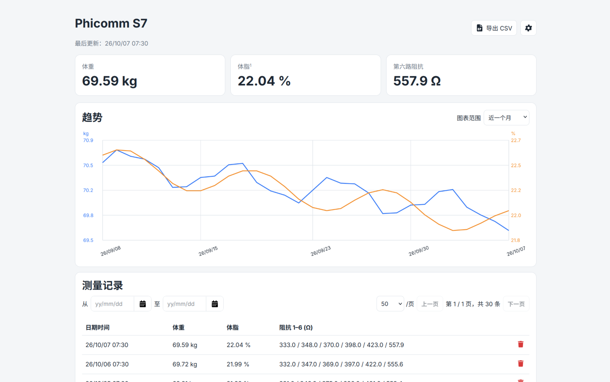
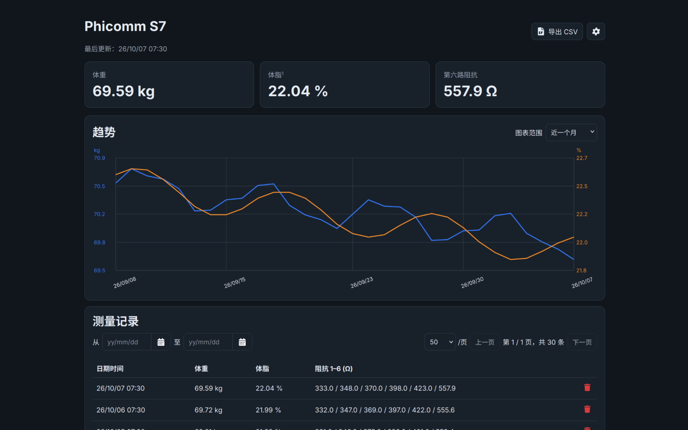
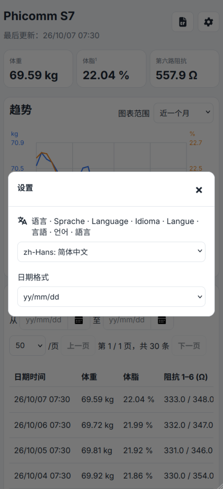
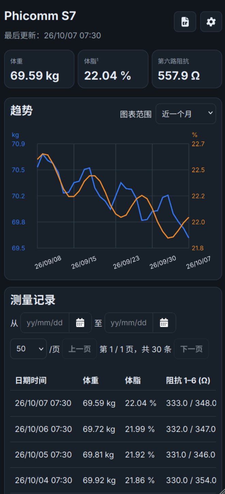

<p align="center"></p>

<p align="center"><a href="README.md">简体中文</a> · English</p>

# `phicomm-s7d`: Local Server for Phicomm S7

`phicomm-s7d` is a local server for the Phicomm S7 body composition scale. It emulates the original cloud TCP service on the local network, stores weight and body fat measurement results, and provides a web dashboard that does not depend on any external resources.

The final program is a statically linked ARM64 executable with the HTML, CSS, JavaScript, and favicon embedded directly into the binary, making it suitable for ARMv8 OpenWrt/ImmortalWrt routers.

> This project is based on interoperability analysis of my own device and captured network traffic. It is not official Phicomm software. Protocol fields and response behavior have only been verified against the currently available samples and devices.

Phicomm is a trademark of its respective owner. **_This project is an independent, unofficial project and is not affiliated with, authorized by, or endorsed by Phicomm or any successor in interest._**

## Features

- Weight & body fat (%) result viewing
- Trend charts
- History storage and CSV export
- Dark mode
- Multilingual support (languages other than Chinese and English are machine-translated for reference only; corrections are welcome)

### Screenshots

<table>
  <tr>
    <td></td>
    <td></td>
  </tr>
  <tr>
    <td></td>
    <td></td>
  </tr>
<!-- Add two more rows -->
</table>

## Deploying on OpenWrt / ImmortalWrt

Before starting, the S7 must already have been configured for Wi-Fi using the original provisioning method and be able to connect to the local network normally. This project only takes over cloud communication after Wi-Fi provisioning is complete; it does not implement the scale's initial setup process.

It is recommended to assign the S7 a static DHCP lease so that firewall source-IP matching does not break if its address changes.

### One-line Install Script

Run the following in an SSH terminal on the router:

```sh
wget -O /tmp/install-phicomm-s7.sh "https://raw.githubusercontent.com/custard-pi/phicomm-s7d/main/install-openwrt.sh" && ash /tmp/install-phicomm-s7.sh
```

Or you can use this command to install from Gitee mirror:

```sh
wget -O /tmp/install-phicomm-s7.sh "https://gitee.com/custard-pi/phicomm-s7d/raw/main/install-openwrt.sh" && GITEE_INSTALL=1 ash /tmp/install-phicomm-s7.sh
```

To install a specific version, run `RELEASE_TAG=v1.0 ash /tmp/install-phicomm-s7.sh`.

The firewall backup is saved at the reported `/tmp/firewall-phicomm-s7-*.backup` path;
copy it elsewhere before rebooting if you wish to retain it.

### Install Maually

The following examples assume:

- OpenWrt router or host running the service: `192.168.1.1`;
- S7: `192.168.1.2`;
- Original S7 server: `106.14.93.199:30101`;
- Device architecture: ARMv8/AArch64;
- Web interface port: `8088`.

Adjust the addresses to match your actual network. Before making firewall changes, it is recommended to keep an SSH session open and back up the configuration:

```sh
uci export firewall > /tmp/firewall.backup
uname -m
```

`uname -m` should output `aarch64`. Other architectures require recompilation for the appropriate target.

#### 1. Install the Program

Copy the binary from your computer:

```sh
scp -O phicomm-s7d-linux-arm64 root@192.168.1.1:/tmp/phicomm-s7d
```

Install it on OpenWrt:

```sh
mkdir -p /etc/phicom-s7
cp /tmp/phicomm-s7d /usr/bin/phicomm-s7d
chmod 0755 /usr/bin/phicomm-s7d
/usr/bin/phicomm-s7d --self-test
```

Expected output:

```text
self-test OK
```

#### 2. Create the Configuration

For the first run, you can launch the program directly in an SSH terminal and answer the interactive prompts:

```sh
/usr/bin/phicomm-s7d --configure
```

`--configure` saves the configuration and exits. Alternatively, create
`/etc/phicom-s7/config.json` manually. Create a valid configuration before running under procd.

```json
{
  "tcp_listen": ":30101",
  "http_listen": ":8088",
  "data_file": "/etc/phicom-s7/measurements.jsonl",
  "height_cm": 180,
  "coef_set": "male",
  "strict_crc": true
}
```

- `tcp_listen`: Listen address for the scale's TCP service. Defaults to `:30101`.
- `http_listen`: Listen address for the Web dashboard's HTTP service. Defaults to `:8088`.
- `data_file`: Path used to store measurement records.
- `height_cm`: Height in centimeters, used for body fat estimation.
- `coef_set`: Selects the regression coefficient set used for body-fat estimation. Available values are `male` and `female`, corresponding to the two coefficient sets described [below](#body-fat-estimation).
- `strict_crc`: Whether to strictly validate the CRC of packets received from the scale. When set to `true`, packets that fail CRC validation are rejected.

After replacing these values with the appropriate settings, restrict access to the configuration file:

```sh
chmod 0600 /etc/phicom-s7/config.json
/usr/bin/phicomm-s7d --check-config
```

#### 3. Add a procd Service

The init script is included as [init.d/phicomm-s7d](init.d/phicomm-s7d). Copy it:

```sh
scp -O init.d/phicomm-s7d root@192.168.1.1:/tmp/phicomm-s7d.init
```

Install, enable, and start it on OpenWrt:

```sh
cp /tmp/phicomm-s7d.init /etc/init.d/phicomm-s7d
chmod 0755 /etc/init.d/phicomm-s7d
/etc/init.d/phicomm-s7d enable
/etc/init.d/phicomm-s7d start
```

After editing the JSON file, run `/etc/init.d/phicomm-s7d reload`; procd detects the change and
restarts the service.
See the [OpenWrt procd documentation](https://openwrt.org/docs/guide-developer/procd-init-scripts).

#### 4. Redirect the S7's Cloud Connection

The installer handles this step automatically. Use the following script for manual
deployment or to adjust the firewall rules separately.

The included `openwrt-firewall-setup.sh` script is compatible with OpenWrt's BusyBox `ash`. Copy and run it:

```sh
scp -O openwrt-firewall-setup.sh root@192.168.1.1:/tmp/
ssh root@192.168.1.1
ash /tmp/openwrt-firewall-setup.sh
```

#### 5. Preserve the Program, Configuration, and Data During sysupgrade

The installer registers these paths automatically. For a manual installation, add the
following lines to `/etc/sysupgrade.conf`, keeping its existing contents:

```text
/usr/bin/phicomm-s7d
/etc/init.d/phicomm-s7d
/etc/phicom-s7/
/etc/rc.d/S95phicomm-s7d
/etc/rc.d/K10phicomm-s7d
```

This covers the binary, init script, default configuration and measurement data, and boot
symlinks. Select the option to keep configuration when upgrading firmware; `sysupgrade -n`
does not preserve these files. Check the actual backup list before upgrading:

```sh
sysupgrade -l | grep -E 'phicomm-s7d|phicom-s7/'
```

If `data_file` points elsewhere on internal storage, add its absolute path separately.
Back up data on USB or other external storage separately and ensure it mounts after
the upgrade. Reuse the binary only if the target firmware remains compatible with
AArch64 Linux. See the [OpenWrt sysupgrade documentation](https://openwrt.org/docs/techref/sysupgrade).

## Usage

Open `http://192.168.1.1:8088/` in a browser to access the dashboard.

Check the logs with:

```sh
logread -f -e phicomm-s7d
```

## Updating and Uninstalling

Rerun the installer to update to the latest stable release, or set `RELEASE_TAG` to select
a version. Download, checksum, or configuration validation failures leave the installed
program untouched. If service startup or firewall configuration fails after replacement,
the installer attempts to restore the previous program, service state, any program
configuration changed during setup, and firewall configuration. Commit or revert any
pending UCI firewall changes before running the installer.

To update the binary:

```sh
/etc/init.d/phicomm-s7d stop
cp /tmp/phicomm-s7d /usr/bin/phicomm-s7d
chmod 0755 /usr/bin/phicomm-s7d
/etc/init.d/phicomm-s7d start
```

To remove the redirection rules while keeping existing data:

```sh
uci -q delete firewall.hijack_phicomm_s7_dnat
uci -q delete firewall.hijack_phicomm_s7_snat
uci commit firewall
/etc/init.d/firewall restart
/etc/init.d/phicomm-s7d disable
/etc/init.d/phicomm-s7d stop
```

## Local Build and Testing

The development machine needs Go, GNU Make, and `sha256sum`. Use the included [Makefile](Makefile):

```sh
make build    # Build the native phicomm-s7d binary
make test     # Build the native binary and run its built-in self-test
make arm64    # Build the static phicomm-s7d-linux-arm64 binary
make release  # Build ARM64, copy/name release assets, and generate individual checksums
```

Running `make` without arguments is equivalent to `make release`. Parallel builds with
`make -j release` are supported. Changes to the source, favicon, or init script rebuild
the affected assets and their checksum files. `make checksums` generates checksums and
automatically builds any required assets.

The Go build cache defaults to `/tmp/phicomm-go-cache`. Override it through the
environment or with `make GOCACHE=/path/to/cache`. Builds and checksum generation
run on the development machine.

### Publishing Release Assets

The installer downloads these six assets from the same release tag:

- `phicomm-s7d-linux-arm64`: the cross-compiled binary above;
- `phicomm-s7d.init`: a copy of `init.d/phicomm-s7d`;
- `phicomm-s7d-linux-arm64.sha256sum`: the binary's SHA-256 checksum file;
- `phicomm-s7d.init.sha256sum`: the init script's SHA-256 checksum file.
- `openwrt-firewall-setup.sh`: the standalone firewall setup script;
- `openwrt-firewall-setup.sh.sha256sum`: the firewall script's SHA-256 checksum file.

Build and prepare the `dist/` upload directory with one command on your development machine:

```sh
make release
```

Upload all six files in `dist/` as GitHub Release assets and tag the matching source commit with
the same release tag, such as `v1.0.1`. The default `latest` selection only considers
stable releases; set `RELEASE_TAG` explicitly for a prerelease. Fill in `GITHUB_REPO`
in the installer once the repository is published.

## How It Works

The S7 initiates a TCP connection to `106.14.93.199:30101`. The router uses DNAT to redirect this connection to the locally running `phicomm-s7d`, which then performs three tasks:

1. Receives and parses the body weight, six impedance channels, and status fields;
2. Returns the acknowledgements and current time required for the scale to continue operating;
3. Stores the raw measurements in JSONL format and exposes them through the HTTP API and web interface.

In the currently captured traffic samples, server responses do not contain body-fat data. They mainly consist of fixed-format acknowledgements, device identification fields copied from the request, and timestamps. Body-fat percentage is therefore not obtained from the server response, but estimated locally from the impedance data.

### Implemented Protocol

Frames on the wire are encoded byte-by-byte with XOR `0x55`. After decoding, frames begin with `55 aa`, use a big-endian length field, and end with a Modbus CRC-16 checksum.

The program currently recognizes and responds to the following commands:

| Request  | Response | Purpose                                            |
| -------- | -------- | -------------------------------------------------- |
| `0x8000` | `0xc000` | Session establishment and time synchronization     |
| `0x8062` | `0xc062` | Measurement data                                   |
| `0x8052` | `0xc052` | Observed control/acknowledgement frame             |
| `0x8090` | `0xc090` | Frame observed in offline or historical-data flows |

For a 64-byte `0x8062` measurement frame:

- Bytes `43..44` are read as a big-endian integer and divided by 100 to obtain the weight in kg;
- Starting at byte `45`, six little-endian 16-bit integers are read and divided by 10 to obtain impedance values in Ω;
- Currently, only the sixth impedance channel is used for body-fat estimation;
- In strict CRC mode, frames with invalid checksums are discarded.

### Body-Fat Estimation

When the sixth impedance channel is within the `250–800 Ω` range, the program uses the BIA fat-free mass regression equations published by Sun et al. The general form used in the code is:

```math
FFM = a + b \frac{height^2}{resistance} + c \cdot weight + d \cdot resistance
```
FFM stands for Fat-Free Mass
```math
body\_fat_{\%} = \left(1 - \frac{FFM}{weight}\right) \times 100
```

Height is measured in cm, weight in kg, and resistance in $\Omega$. The coefficients used are:

| `coef_set` |    `a` |  `b` |  `c` |  `d` |
| ---------- | -----: | ---: | ---: | ---: |
| `male`     | -10.68 | 0.65 | 0.26 | 0.02 |
| `female`   |  -9.53 | 0.69 | 0.17 | 0.02 |

The `resistance` value used here is the S7's sixth impedance channel, not the directly measured 50 kHz whole-body impedance used by the equipment in the original study. Therefore, **the result should be treated as a trend estimate and must not be used as a substitute for medical-grade body composition measurements**.

The equation and coefficients are taken from:

Sun SS et al., _Development of bioelectrical impedance analysis prediction equations for body composition with the use of a multicomponent model for use in epidemiologic surveys_, Am J Clin Nutr. 2003;77(2):331–340.  
[PMID 12540391](https://pubmed.ncbi.nlm.nih.gov/12540391/) · [DOI 10.1093/ajcn/77.2.331](https://doi.org/10.1093/ajcn/77.2.331)
